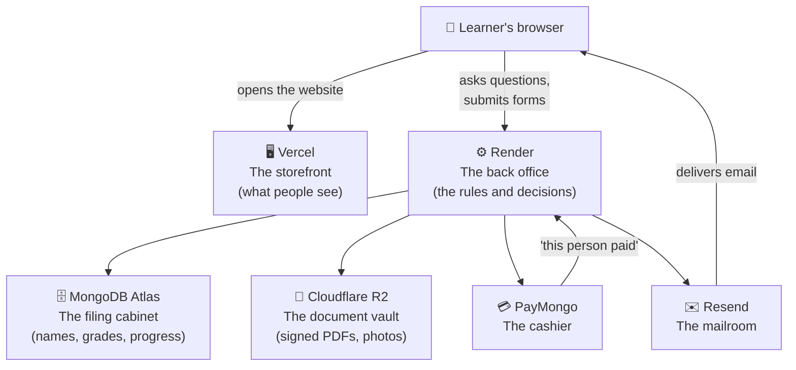
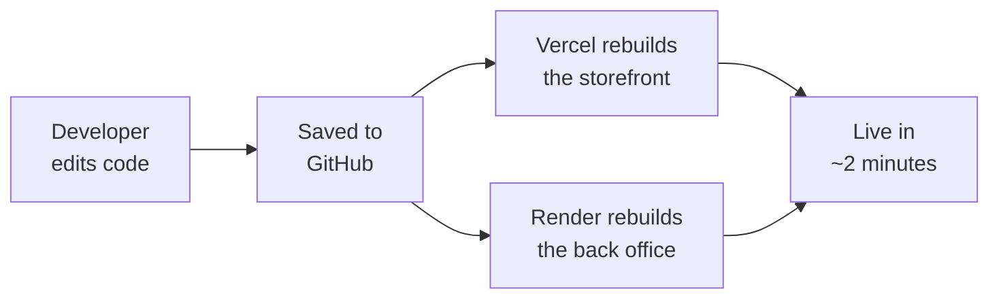

# Tree Academy — How It All Works

A plain-language guide to what this application is built from, written for people who don't write
code. No prior technical knowledge assumed.

If you're a developer, you want [CLAUDE.md](CLAUDE.md) and [DEPLOYMENT.md](DEPLOYMENT.md) instead.

---

## 1. What the application does

Tree Academy is a review academy for real-estate brokers, consultants, and agents. The software
handles two jobs:

**Enrollment (open to the public).** Someone fills in their details, signs the academy's agreement
inside their browser, pays online, and receives their login. No staff member has to do anything for
this to happen — it's automatic, end to end.

**The learning platform (invite-only).** Once enrolled, that person logs in and sees the review
course for their pathway — lessons, PDFs, quizzes, progress tracking, and a certificate at the end.

---

## 2. The big picture

The application is not one program. It's five separate services that talk to each other over the
internet. Think of it as a small office where each room does one job:

**Why split it up?** Each service is genuinely good at one thing, and using the right tool for each
job is cheaper and more reliable than forcing one service to do everything. It also means a problem
in one room doesn't burn down the building — if email breaks, enrollments still work.

### Where each piece lives

| Room | Service | What would happen without it |
| --- | --- | --- |
| Storefront | **Vercel** | Nobody could see the website |
| Back office | **Render** | The site would load but nothing would work |
| Filing cabinet | **MongoDB Atlas** | No accounts, no progress, no records |
| Document vault | **Cloudflare R2** | Signed agreements would vanish on every update |
| Cashier | **PayMongo** | No way to take payment |
| Mailroom | **Resend** | No welcome emails, no receipts |

---

## 3. The storefront — what people actually see

Everything in this section runs **inside the visitor's browser**, not on a server.

| Tool | Its job, in one line |
| --- | --- |
| **React** | The system that draws every button, form, and page. The foundation of the entire visible half. |
| **Vite** | Packages all the code into a small, fast bundle. Also gives developers instant preview while editing. |
| **React Router** | Handles moving between pages without the browser reloading — why the site feels like an app, not a document. |
| **React Query** | Fetches data from the back office and remembers it, so the same information isn't re-downloaded on every click. |
| **Tailwind CSS** | The styling system — colors, spacing, layout. Everything you'd call "the design." |
| **Framer Motion** | Movement. Fades, slides, and transitions. |
| **Lucide** | The icon set. |
| **Tiptap** | The rich-text editor instructors type lesson content into — bold, links, lists. Like a small Word. |
| **DOMPurify** | A safety filter on anything an instructor types, so formatted text can never smuggle in malicious code. |
| **React Hook Form + Zod** | Catch mistakes in forms *while you type* — "that's not a valid email" — before anything is submitted. |
| **PDF.js** | Displays the agreement PDF on screen during signing, so you type into the real document rather than a copy of it. |
| **Socket.IO (client)** | Keeps a live line open to the back office, so "who's online" updates by itself. |

---

## 4. The back office — the part that makes decisions

This runs on Render. Visitors never see it; their browser only asks it questions.

**Its most important job is being the only thing that can be trusted.** Anything running in a
browser can be tampered with by whoever is using that browser. So every rule that actually matters
— who may see what, whether a payment really happened — is enforced here, where nobody can reach it.

| Tool | Its job, in one line |
| --- | --- |
| **Node.js** | Lets the same programming language that runs in browsers also run on a server. |
| **Express** | The receptionist — takes each incoming request and routes it to the right handler. |
| **Mongoose** | The translator between the application and the database. Also enforces shape: a learner record must have an email, a score must be a number. |
| **Socket.IO (server)** | The other end of that live line — powers presence and instant updates. |
| **JSON Web Tokens** | The wristband system. After you log in you get a signed pass that proves who you are, without re-entering your password on every click. |
| **bcrypt** | Scrambles passwords irreversibly before storing them. Even someone holding the whole database cannot read them. |
| **Helmet** | Sets protective browser rules on every response — standard hardening. |
| **CORS** | The bouncer. Only the real Tree Academy website may call the back office; a copycat site is refused. |
| **Rate limiting** | Blocks anyone hammering the login page trying thousands of passwords. |
| **Multer** | Receives uploaded files (profile photos, assignment submissions) safely. |
| **pdf-lib** | Generates the real PDFs — fills the agreement, stamps the signature, flattens it so it can't be altered, and renders certificates. |
| **AWS SDK** | Speaks the language of file storage, used to talk to Cloudflare R2. |
| **Zod** | Re-checks every submission on arrival. The browser checked it too, but the browser can be lied to — this check is the one that counts. |

---

## 5. The outside services

### MongoDB Atlas — the filing cabinet
Stores everything *written*: learners, enrollments, courses, lessons, quiz scores, progress,
certificates, email templates, prices. Hosted and backed up by MongoDB, so nobody has to babysit a
database server.

**Files are deliberately not stored here.** The cabinet holds the *label* pointing to each document;
the documents themselves live in the vault.

### Cloudflare R2 — the document vault
Holds signed enrollment agreements, generated certificates, profile photos, and course banners.

This exists because of a specific, unforgiving problem: **Render wipes its hard drive every time the
application is updated.** Storing signed legal agreements there would destroy them, silently, on a
routine update. R2 is permanent, external storage, and the application now *refuses to start* in
production without it — a deliberate guard so this can never be misconfigured by accident.

The vault is private. Documents are never reachable by guessing a web address; every download goes
through the back office, which checks who is asking first.

### PayMongo — the cashier
Handles GCash, Maya, cards, and QR Ph. Card numbers never touch Tree Academy's systems — the learner
is handed to PayMongo's own payment page and returned afterwards.

**The important detail:** the browser returning from PayMongo saying "I paid!" is *not* believed.
Anyone can type that web address. Instead PayMongo sends a separate, cryptographically signed
message directly to the back office, and only that message unlocks the course. It's the difference
between a customer claiming they paid and the bank confirming it.

### Resend — the mailroom
Delivers the receipt, the welcome-and-set-your-password email, and staff notifications. Staff can
edit the wording of these emails from the admin area without a developer.

Email is treated as best-effort on purpose: if the mailroom is down, the enrollment still completes
and the payment still counts. A failed email never blocks a paying customer.

### Vercel & Render — the two landlords
**Vercel** serves the storefront — free, fast, worldwide. **Render** runs the back office, because
it keeps a program running continuously, which the live "who's online" feature requires and Vercel
cannot do.

Both watch GitHub. Publishing an update means saving the code to GitHub; both sites rebuild
themselves within a couple of minutes.

---

## 6. Walkthrough: one enrollment, start to finish

This is where the tools stop being a list and start being a system.

| # | What happens | Who does it |
| --- | --- | --- |
| 1 | Visitor opens the site and fills in their details | **React** draws it, **Zod** checks it as they type |
| 2 | Details are sent to the back office | **Express** receives, **Zod** re-checks, **Mongoose** files it in **Atlas** |
| 3 | The agreement appears on screen with real, typeable fields | **PDF.js** displays the actual document |
| 4 | They sign with a finger or mouse and submit | **pdf-lib** fills the real PDF, stamps the signature, and flattens it |
| 5 | The signed agreement is stored, staff are notified | Saved to **R2**; **Resend** emails the office |
| 6 | They choose full payment or the reservation fee, and pay | **PayMongo** takes over on its own secure page |
| 7 | PayMongo confirms the payment privately to the back office | Signature verified — this is the only step that grants access |
| 8 | An account is created and access to their course is granted | **bcrypt** protects the password, **Mongoose** records the access |
| 9 | Receipt and "set your password" email arrive | **Resend** delivers both |
| 10 | They set a password and log in | **JWT** issues the pass that keeps them logged in |
| 11 | They see their course — and only their course | Enforced by the back office, not hidden by the website |
| 12 | They finish and receive a certificate | **pdf-lib** renders it, **R2** stores it |

Steps 7 and 11 are the two that carry the real weight. Step 7 is why nobody can get a free course by
editing a web address. Step 11 is why a learner can't reach another pathway's course by typing its
link — the back office simply won't send it.

---

## 7. How updates get published

Developers work on a copy running entirely on their own computer, using local files and a test
cashier, so experiments never touch real learners or real money. Only saving to GitHub publishes
anything.

---

## 8. Running costs

| Service | Cost |
| --- | --- |
| Vercel | Free |
| Render | Free to start; **~$7/month recommended** — see below |
| MongoDB Atlas | Free tier |
| Cloudflare R2 | Effectively free at this scale |
| Resend | Free up to 3,000 emails/month |
| PayMongo | Per-transaction fee only |

**The one upgrade worth making:** Render's free plan puts the back office to sleep after 15 minutes
of no visitors, and the next person to arrive waits 30–50 seconds for it to wake. Worse, a payment
confirmation can arrive while it's asleep. Before real learners use this, move Render to the paid
plan.

---

## 9. Glossary

**Server** — a computer that's always on, waiting to answer requests.
**Client / frontend** — the part running in the visitor's own browser.
**Backend / API** — the part running on a server that the frontend asks for things.
**Database** — organized permanent storage for information.
**Webhook** — one service phoning another directly to report an event, rather than being asked.
**Environment variable** — a setting (password, address, key) kept outside the code so it can differ
between the test version and the live one, and never gets published.
**Deploy** — publish a new version.
**Repository** — the project's code and its full history, stored on GitHub.
**Token** — a temporary signed pass proving identity without resending a password.
**Hashing** — one-way scrambling. You can check a password matches, but never read it back.
